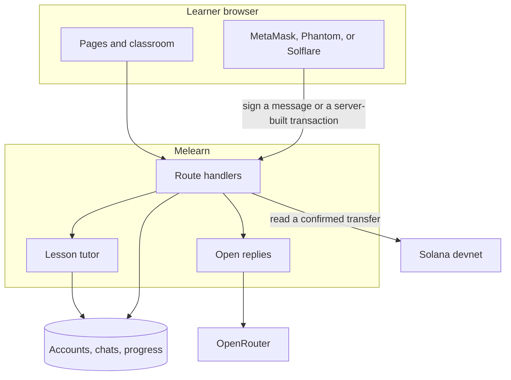

# Melearn Chat

An AI classroom for a Solana demo. Ray teaches English and Pi teaches mathematics. A visitor can preview a lesson. A real chat starts after sign-in. The live app is [https://chat.melearn.io](https://chat.melearn.io).

During the demo every lesson is open and nothing is charged. One account can send 10 messages in 24 hours, then waits for that window to reload. The Pro plan on the landing page is sample copy, not a product for sale.

## Architecture

The browser talks only to this application's route handlers. Accounts, conversations, progress, and entitlements stay in the database. A wallet proves control of a key. A Solana devnet transfer, when one is built, carries the payment and a purchase reference, not the learner's name or chat.



Sign-in with MetaMask uses SIWE. Phantom and Solflare use Sign In With Solana. The server writes the message, checks the signature, and then issues the same session as a password account. The signature does not authorize a transaction, and the app never asks for a seed phrase.

Hints, examples, practice, and grading stay in the lesson tutor. An ordinary reply can call OpenRouter (`openai/gpt-6-luna-pro`) when an API key is configured. A sentence in chat such as "I already paid" does not unlock a lesson.

The purchase routes can quote a devnet SOL transfer, ask the wallet to sign the transaction this server assembled, and accept it only when the payer, recipient, amount, and memo match that quote. The public demo does not send learners through checkout. Those routes and `lib/solana.ts` are there to read in the codebase.

More of the same map is in [docs/web3.md](docs/web3.md).

## Run locally

Node.js 22 or newer.

```bash
npm install
npm run dev
```

Open [http://127.0.0.1:43123](http://127.0.0.1:43123). Copy `.env.example` to `.env.local` and set `AI_API_KEY` if open replies should call the model. Without that key, the lesson tutor answers.

```bash
npm test
npm run lint
```

## Routes

- `app/(public)/`: landing, login, and pricing
- `app/(user)/`: teachers, classroom, chats, and profile
- `app/api/`: session checks, learning, wallet sign-in, and purchase verification

A guest may open `/learn/[lessonId]` and see a greeting. Sending a message requires a session.
