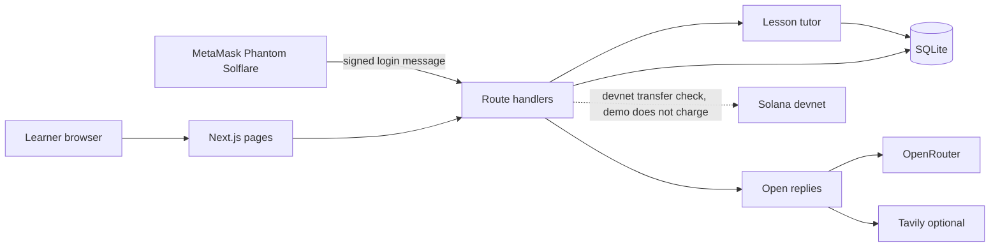

# Melearn architecture

The reviewer map, including the Web3 boundary, is [web3.md](web3.md). This file is the shorter view of the same app. Production runs on the Cloudflare Worker `melearn-chat` at `chat.melearn.io` with D1. Local development is one Next.js process on port 43123 with SQLite.

## Shape

A learner uses one Next.js 15 app. Public pages and the classroom are React route groups. Route handlers in `app/api` are the only write path. Locally the database is SQLite at `data/melearn.db`. Production uses the same schema on Cloudflare D1.

## Pages

| Area | Routes | Role |
| --- | --- | --- |
| Public | `/`, `/pricing`, `/login`, `/setup` | Landing, sample pricing, sign-in, first-time learning preferences |
| Classroom | `/app`, `/teachers/[id]`, `/learn/[lessonId]`, `/chats`, `/learning`, `/profile` | Choose a teacher, preview or study, history, account |
| Unlock | `/unlock/[lessonId]` | Checkout UI. The demo does not take payment |

A guest may open a lesson and see a static greeting. Sending a message, asking for a hint or example, or starting practice requires a session. The API returns 401 without one.

## Server responsibilities

Auth is a signed session cookie. Password accounts and wallet accounts share the same user record. Wallet login is checked on this server: MetaMask with SIWE (`personal_sign`), Phantom and Solflare with SIWS (Ed25519). Login does not call an RPC or a hosted identity provider. Details are in [wallet-login.md](wallet-login.md).

Learning owns conversations, messages, progress, and a quota of 10 messages per account per 24 hours. A repeated `clientMessageId` does not create a second turn.

Two reply paths:

- Hints, examples, practice, and grading stay in the lesson tutor. They are not sent to a model. Entitlements and scores are decided here.
- An ordinary chat message can call OpenRouter (`openai/gpt-6-luna-pro` by default) when `AI_API_KEY` is set. If the key is missing, or the message is a grading turn or a guarded claim such as "I already paid", the tutor answers instead.
- When `TAVILY_API_KEY` is set, a current-facts question can add web results. Those results are untrusted context. Links are attached to the answer. Without the key, there is no web search.
- When `SUPADATA_API_KEY` is set and the message contains a YouTube link, existing captions are loaded with `mode=native` and given to the model as untrusted context. A missing caption does not let the model invent the video. Hints and grading do not call Supadata.

## Data

SQLite tables: `users`, `guests`, `conversations`, `messages`, `progress`, `quotas`, `purchases`, `entitlements`, `wallet_challenges`. Profile columns added in place: `avatar_url`, `education_stage`, `preferred_subject`.

Chat text, names, and grades stay off-chain. A Solana devnet transfer, if one is built, carries the payment only.

The Cloudflare D1 migrations and `scripts/export-cloudflare-data.mjs` are an export path, not the database the dev server uses.

## What is intentionally not live

- Pro on the landing page is sample copy. The top-up control does not charge.
- Purchase routes and `@solana/kit` checks implement a devnet SOL transfer with a purchase memo. The demo leaves every lesson open, so that path is not the public checkout. A chat message cannot unlock a lesson. Details are in [web3.md](web3.md).
- Open replies call OpenRouter when an API key is configured.
