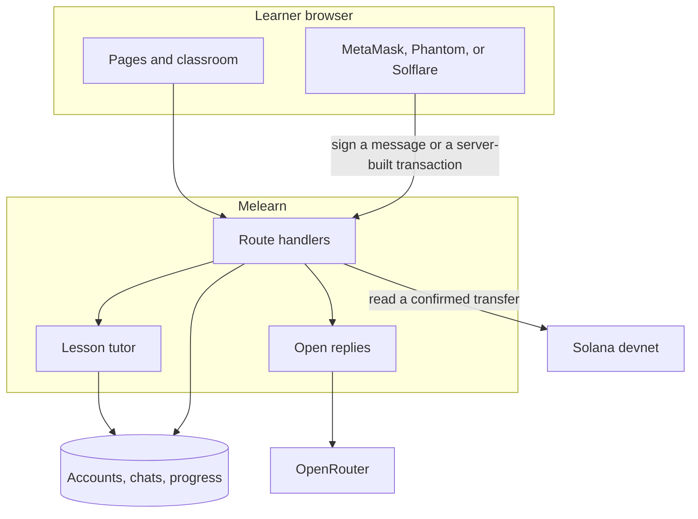
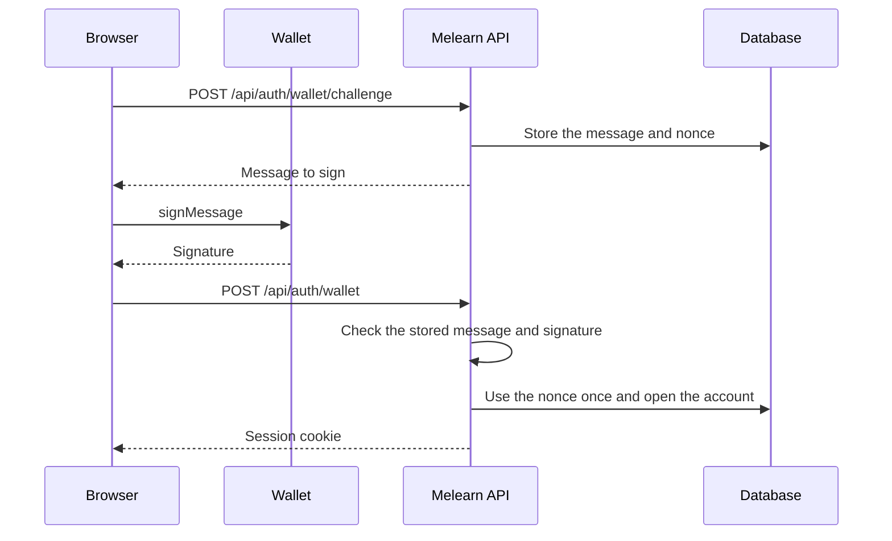
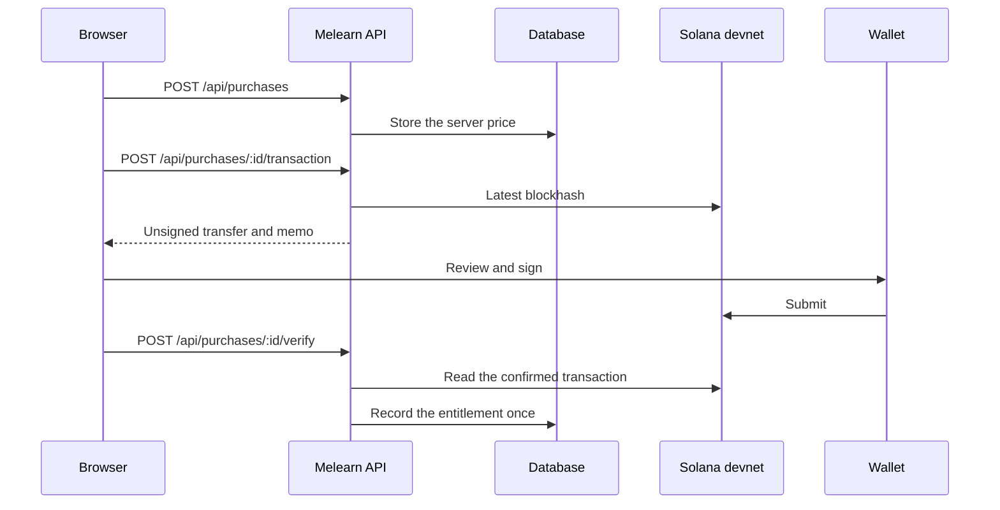

# Melearn Chat — architecture

This is the same map as the README, with the two Web3 sequences drawn out. The behavior lives in `lib/wallet-login.ts`, `lib/solana.ts`, `lib/verify-transfer.ts`, and `lib/purchases.ts`.

## System

Production serves [chat.melearn.io](https://chat.melearn.io). Local development uses `npm run dev` and SQLite. Chat text, names, and grades stay in the database. A devnet transfer, when built, carries the payment and the purchase id.

## Sign in with a wallet

MetaMask signs a SIWE message. Phantom and Solflare sign a Sign In With Solana message. The server checks the signature locally and then creates or reuses the account.

An existing password or Google account can attach a Solana address through `POST /api/wallet/challenge` and `POST /api/wallet/verify`. The learning identity remains the Melearn user id.

## Devnet payment

Two lessons are marked paid in the content files. A quote is 0.01 SOL on devnet. The demo leaves every lesson open, and the landing page does not sell Pro. The sequence below is what the purchase routes do when they are called.

The transaction is a SOL transfer plus a memo `melearn:<purchaseId>`. Fulfillment checks the payer, recipient, amount, and memo against the stored quote. Confirming the same signature again does not create a second entitlement.

Hints, grading, and entitlements are decided on the server. They are not taken from the model or from a sentence in the chat.
